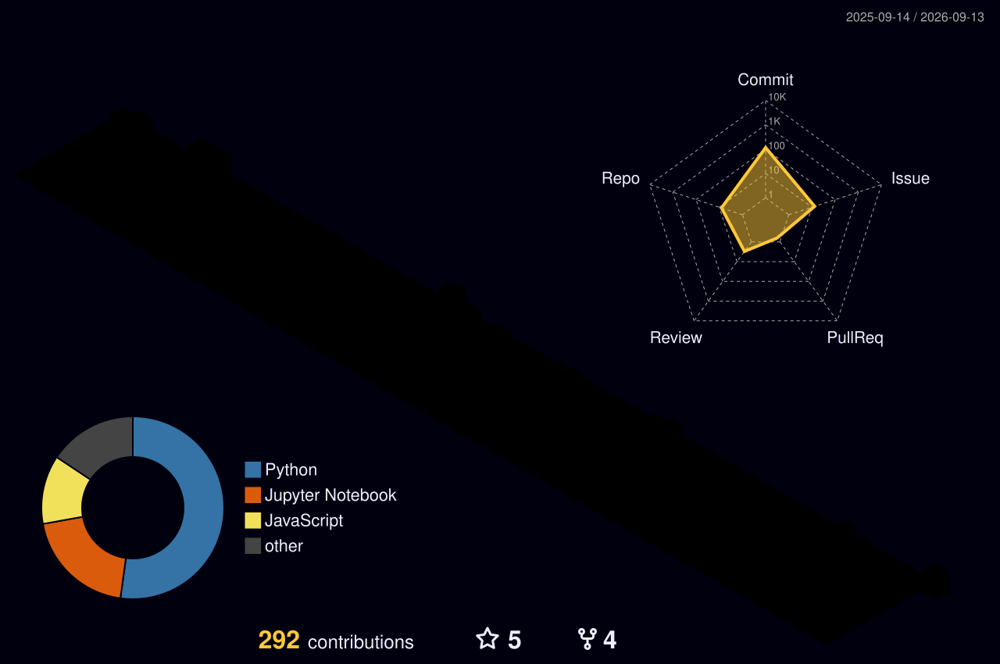

<!-- ========================================================= -->
<!--                        HEADER                             -->
<!-- ========================================================= -->

 

  

  

<samp>
Backend Engineer · Distributed Systems · Agentic AI
</samp>

<!-- ========================================================= -->
<!--                         ABOUT                             -->
<!-- ========================================================= -->

<h2 align="center">⚡ what i do</h2>

<samp>

build scalable backend systems
 
design distributed systems
 
build autonomous AI agents
 
turn enterprise data into intelligent products

</samp>

<!-- ========================================================= -->
<!--                       LANGUAGES                           -->
<!-- ========================================================= -->

<h3 align="center">languages</h3>

<!-- ========================================================= -->
<!--                 BACKEND & DATABASES                      -->
<!-- ========================================================= -->

<h3 align="center">backend & databases</h3>

<!-- ========================================================= -->
<!--                         AI / ML                           -->
<!-- ========================================================= -->

<h3 align="center">ai / ml</h3>

<samp>
LangGraph · Google ADK · OpenAI Agents SDK
 
RAG · Multi-Agent Systems · Agentic AI · LLMs
 
Optuna · NumPy · Pandas · Computer Vision
</samp>

<!-- ========================================================= -->
<!--                   TOOLS & ENGINEERING                    -->
<!-- ========================================================= -->

<h3 align="center">tools & engineering</h3>

<samp>
DSA · OOP · DBMS · OS · Distributed Systems
 
REST APIs · WebSockets · SQL · System Design
 
Performance Profiling · Load Testing
</samp>

<!-- ========================================================= -->
<!--                  ENGINEERING HIGHLIGHTS                  -->
<!-- ========================================================= -->

<h2 align="center">⚡ engineering highlights</h2>

<!-- ========================================================= -->
<!--                       EXPERIENCE                          -->
<!-- ========================================================= -->

<h2 align="center">💼 experience</h2>

<table align="center">

<tr>
<td width="100%">

### 🤖 AI Products Intern — Logesys Solutions

<samp>
Enterprise AI · LangGraph · Google ADK · NL → SQL
</samp>

  

• Architecting <b>10+ autonomous AI agents</b> for enterprise AutoInsights  
 
• Migrated critical workflows from Google ADK to LangGraph  
 
• Reduced end-to-end execution latency by <b>up to 60%</b>  
 
• Engineering metadata-driven Natural Language → SQL systems  
 
• Building retrieval pipelines for web intelligence and enterprise analytics

</td>
</tr>

<tr>
<td width="100%">

### ⚡ Software Development Intern — Nexrova

<samp>
FastAPI · REST APIs · Python · SQL · Database Architecture
</samp>

  

• Designed and implemented REST APIs for hospitality workflows  
 
• Designed database schemas across <b>10+ entities</b>  
 
• Built automated guest check-in workflows  
 
• Worked with a 4-member engineering team on MVP planning and technical discussions

</td>
</tr>

<tr>
<td width="100%">

### 🧩 Software Development Intern — Promon

<samp>
Django REST Framework · SQL · Performance Profiling · JMeter
</samp>

  

• Built and maintained REST APIs for identity validation services  
 
• Improved API response times by approximately <b>35%</b>  
 
• Profiled bottlenecks using Django Silk  
 
• Directed load and stress testing using Apache JMeter

</td>
</tr>

</table>

<!-- ========================================================= -->
<!--                     FEATURED PROJECTS                     -->
<!-- ========================================================= -->

<h2 align="center">🛠️ featured projects</h2>

<table align="center">

<tr>

<td width="50%" align="center">

<h3>🎓 AI Academic Assistant</h3>

<samp>
Full-stack AI platform built for VIT students
</samp>

  

  

<samp>
OCR · RAG · Multi-Agent Systems
 
OpenAI Agents SDK · JWT · Supabase
 
PYQ Analytics · AI Chat · PDF Generation
</samp>

</td>

<td width="50%" align="center">

<h3>⚙️ JanusForge</h3>

<samp>
Distributed ML job execution platform
</samp>

  

  

<samp>
Worker Nodes · Hardware Scheduling
 
Heartbeats · Retries · Stale Job Recovery
 
Distributed Hyperparameter Optimization
</samp>

</td>

</tr>

<tr>

<td width="50%" align="center">

<h3>⚖️ ClauseVader</h3>

<samp>
AI-powered legal contract analyzer
</samp>

  

  

<samp>
GPT-4 · Risk & Fairness Scoring
 
Contract Q&A · Document History
 
PDF / DOCX Processing
</samp>

  

🏆 <b>4th / 190+ teams</b>

</td>

<td width="50%" align="center">

<h3>🤖 Enterprise AI Systems</h3>

<samp>
Intelligent analytics and retrieval systems
</samp>

  

<samp>
Autonomous Agents
 
Natural Language → SQL
 
Metadata-driven Analytics
 
Retrieval Pipelines
</samp>

</td>

</tr>

</table>

<!-- ========================================================= -->
<!--                    GITHUB STATISTICS                      -->
<!-- ========================================================= -->

<h2 align="center">📊 github statistics</h2>

<!-- ========================================================= -->
<!--                  GITHUB STREAK                           -->
<!-- ========================================================= -->

<h2 align="center">🔥 contribution activity</h2>

<!-- ========================================================= -->
<!--                  ACTIVITY GRAPH                           -->
<!-- ========================================================= -->

<!-- ========================================================= -->
<!--                 3D CONTRIBUTION                          -->
<!-- ========================================================= -->

<h2 align="center">🌐 3D contribution profile</h2>

<!-- ========================================================= -->
<!--                  CONTRIBUTION SNAKE                      -->
<!-- ========================================================= -->

<h2 align="center">🐍 contribution snake</h2>

<picture>
  <source
    media="(prefers-color-scheme: dark)"
    srcset="https://raw.githubusercontent.com/JHK0723/JHK0723/output/github-contribution-grid-snake-dark.svg"
  />

  <source
    media="(prefers-color-scheme: light)"
    srcset="https://raw.githubusercontent.com/JHK0723/JHK0723/output/github-contribution-grid-snake.svg"
  />

  

</picture>

<!-- ========================================================= -->
<!--                       ACHIEVEMENTS                        -->
<!-- ========================================================= -->

<h2 align="center">🏆 achievements</h2>

🥇 <b>Innovative Product Award</b>
 
FedEx + JA India International Trade Challenge

  

🏆 <b>4th Place — ClauseVader</b>
 
190+ teams

  

📜 <b>Scientific Computing with Python</b>
 
freeCodeCamp · 2025

  

📜 <b>Linear Algebra: Foundations to Frontiers</b>
 
UT Austin · 2024

<!-- ========================================================= -->
<!--                       LEADERSHIP                          -->
<!-- ========================================================= -->

<h2 align="center">👥 leadership</h2>

<b>Microsoft Innovations Club</b>
 
AI Agents Team Lead

  

Technical workshops · AI initiatives · 70+ participants

<!-- ========================================================= -->
<!--                    PROBLEM SOLVING                        -->
<!-- ========================================================= -->

<h2 align="center">🧠 problem solving</h2>

<!-- ========================================================= -->
<!--                         FOOTER                            -->
<!-- ========================================================= -->

 

<samp>
building things that should probably be automated
</samp>

  

